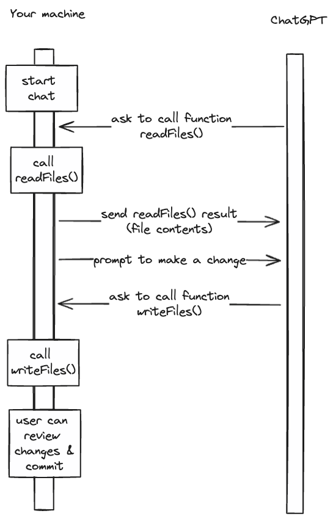

# chisel

 A command line GPT-4 chat loop that can directly read and write code on your local filesystem

## Status

alpha/proof of concept.

Currently this is can only work with small apps, or subdirectories of larger apps. The model used, `gpt-4-1106-preview` has a [128k context window](https://platform.openai.com/docs/models/gpt-4-and-gpt-4-turbo) ("300 pages of text"). Larger codebases and longer chats could exceed that window and `chisel` might start forgetting about your code or its job. The CLI logs tokens used to help keep an eye on this.

The maximum output size is also 4096 tokens, so there may be issues on larger files.

## Quick Start

- `git clone https://github.com/martinpllu/chisel`
- `cd chisel`
- `npm install`
- Add a file `.env` containing:

```env
OPENAI_API_KEY=your_api_key_here
```
- (Note that you need to enable [pay-as-you-go billing](https://lifehacker.com/openai-s-pay-as-you-go-is-the-best-way-to-use-chatgpt-1850318349) and have a positive credit balance, e.g. $10)
- Start via `npx tsx src/index.ts --directory=/path/to/your/app`
- `chisel` will start by sending the content of all files in the directory to chatgpt. 
  - Files in `src/read-files.ts#DEFAULT_IGNORE_PATHS` will be ignored, as will any glob paths passed as `--ignorePaths`
- Prompt the CLI to make a code change, e.g. `Improve the README` and `chisel` will change the required file(s)
- You can then review changes. If your application is managed with git you can review the diffs and commit.
- You can also ask `chisel` questions about the code.
- Press Ctri-C to quit.

## How does it work?

`chisel` uses ChatGPT's [function calling](https://platform.openai.com/docs/guides/function-calling) feature. Two functions are used:

- `readFiles` which reads all files in the supplied directory (the `--directory` argument), apart fromt he ignored files and returns their contents. 
- `writeFiles` which accepts a list of paths within the directory, and a corresponding list of file contents to write.



## Safety

`chisel` can only read and write files within the supplied directory. All ChatGPT-supplied paths are checked to ensure that they resolve to files which are actually within the directory.

## License

This project is open source and available under the ISC License.
